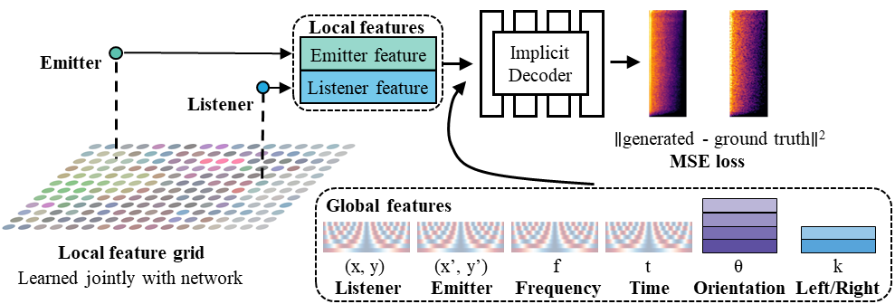
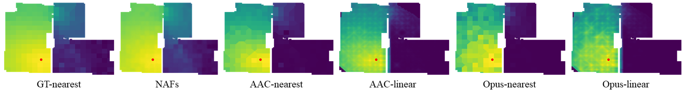
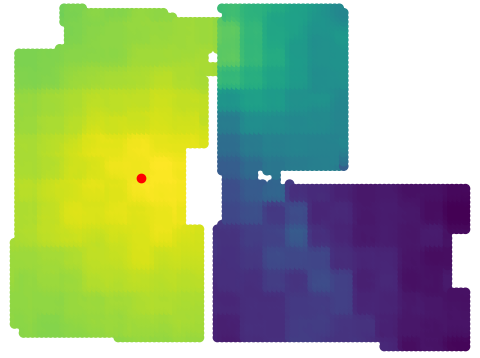
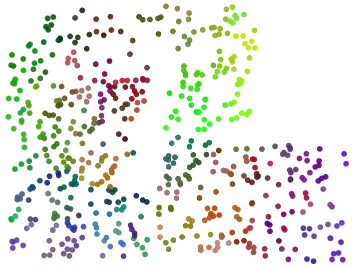
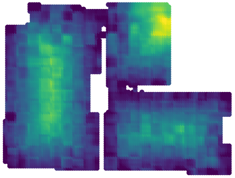

# Learning Neural Acoustic Fields (Accepted at NeurIPS 2022)
Code release for: **Learning Neural Acoustic Fields**
<p align="center">
  
</p>

[Paper link](https://arxiv.org/abs/2204.00628), [Project site](https://www.andrew.cmu.edu/user/afluo/Neural_Acoustic_Fields/),
[](https://colab.research.google.com/drive/1C1qyOMFUBlrdEiaWJQ_1Zi5UDHvWumyk?usp=sharing)


 
For help contact `afluo [a.t] andrew.cmu.edu` or open an issue.

### Abstract
Our environment is filled with rich and dynamic acoustic information. When we walk into a cathedral, the reverberations as much as appearance inform us of the sanctuary's wide open space. Similarly, as an object moves around us, we expect the sound emitted to also exhibit this movement. While recent advances in learned implicit functions have led to increasingly higher quality representations of the visual world, there have not been commensurate advances in learning spatial auditory representations. To address this gap, we introduce Neural Acoustic Fields (NAFs), an implicit representation that captures how sounds propagate in a physical scene. By modeling acoustic propagation in a scene as a linear time-invariant system, NAFs learn to continuously map all emitter and listener location pairs to a neural impulse response function that can then be applied to arbitrary sounds. We demonstrate that the continuous nature of NAFs enables us to render spatial acoustics for a listener at an arbitrary location, and can predict sound propagation at novel locations. We further show that the representation learned by NAFs can help improve visual learning with sparse views. Finally we show that a representation informative of scene structure emerges during the learning of NAFs. 

Note: This code implementation does not model phase, and instead uses random phase [test_utils.py#L21](https://github.com/aluo-x/Learning_Neural_Acoustic_Fields/blob/master/testing/test_utils.py#L21) similar to Image2Reverb. We still include the code to generate instantaneous frequency phase information in the function [if_compute](https://github.com/aluo-x/Learning_Neural_Acoustic_Fields/blob/master/data_loading/data_maker.ipynb), and to go back to the wav in [get_wave_if](https://github.com/aluo-x/Learning_Neural_Acoustic_Fields/blob/master/data_loading/data_maker.ipynb). We observe that this released code can achieve better/comparable spectral/T60 error than the variant described in the paper, and yields fewer clicking artifacts when stiching the demo video. Prior work like Image2Reverb, Signal Agnoistic Manifolds use random/griffin-lim phase and learn magnitude only representations, while followup work like [AV-NeRF](https://arxiv.org/abs/2302.02088) also do not learn the phase and reuse the input phase.

#### Demo (unmute!)
https://user-images.githubusercontent.com/15619682/158037642-6a5bd731-e45f-4eb1-b29f-60447acfb824.mp4

Song credit: Just Smile (ft. Milow) - 2017; All credits go to Gamper & Dadoni.

#### Comparison against baselines 
<p align="center">
  
</p>


### Codebase
* Requirements (in addition to the usual python stack)
  * Pytorch 1.9 (1.10 should work as well)
  * h5py
  * numpy
  * scipy
  * matplotlib
  * sklearn (for linear probe and feature visualization)
  * librosa (for training data parsing)
  * ffmpeg 5.0 (for AAC-LC baseline only) - compile/use docker
  * opus-tools 0.2 & libopus 1.3.1 (for Xiph-opus baseline only) - install `opus-tools` via conda-forge
  * Tested on Ubuntu 20.04 and 21.10

Download [checkpoints and metadata here](https://u.pcloud.link/publink/show?code=XZFwnVVZznXFtR6rL4VBO0Yw2pWxTzYpsVpX). Open the torrent file with qbittorrent. Extract these under `./Neural_Acoustic_Fields/`.
```
Project structure
|-Neural_Acoustic_Fields
  |-baselines
    |-make_data_aac.py
      # Code for generating AAC-LC baseline, uses ffmpeg
    |-make_data_opus.py
      # Code for generating Xiph opus baseline, uses opus-tools
  |-data_loading
    |-sound_loader.py
      # Code that contains the dataset definition for our training data
  |-metadata
    |-magnitudes 
    |-mean_std
    |minmax
    *
    *
    * # Various data for training/testing
  |-model
    |-modules.py
      # Contains the definition for sinusoidal embedding and other non-network parts
    |-networks.py
      # Contains various differentiable modules to build our network
  |-testing
    |-cache_feature_NAF.py
      # Cache the NAF features, so you can visualize them using "vis_feat_NAF.py", also for linear probe
    |-cache_test_baseline.py
      # Cache the results from interpolation baselines
    |-cache_test_NAF.py
      # Cache the NAF results for the test set
    |-compute_spectral_baseline.py
      # Compute the spectral loss for the interpolation baselines (run cache_test_baseline.py first)
    |-compute_spectral_NAF.py
      # Compute the spectral loss for the NAF results (run cache_test_NAF.py first)
    |-compute_T60_err_baseline.py
      # Compute the T60 error for the interpolation baselines (run cache_test_baseline.py first)
    |-compute_T60_err_NAF.py
      # Compute the T60 error for the NAF results (run cache_test_NAF.py first)
    |-lin_probe_NAF.py
      # Fits a linear probe to NAF features, saves the images to ./results/depth_img (run cache_feature_NAF.py first)
    |-test_utils.py
      # Various tools that can help with testing
    |-vis_feat_NAF.py
      # Use TSNE to visualize the NAF features (run cache_feature_NAF.py first)
    |-vis_loudness_NAF.py
      # Query the network to get the loudness at all locations in a room for a given emitter
  |-results
    |-apartment_1 # weights for network trained on apartment_1
    |-apartment_2 # weights for network trained on apartment_2
    |-depth_img
    *
    *
    * # Various network/baseline outputs
  |-train.py
    # Contains the training loop for the NAF network
```
### Common use cases
* Training the NAF network with 4 GPUs from scratch (uses pytorch DDP)

  * `python train.py --apt apartment_1 --epochs 200 --resume 0 --batch_size 20 --gpus 4`


* Testing the numerical results for the NAF (single GPU)
  
  Note this will ask our NAF to generate the data at the test locations, and then compute the spectral(L1)/T60 scores

   * `python ./testing/cache_test_NAF.py; python ./testing/compute_spectral_NAF.py`


* Generate the baseline testing data

  We utilize a ramdisk to cache the intermediate results prior to decoding to wav, this is quite time intensive.
  ```
  sudo mkdir /mnt/ramdisk
  sudo chmod 777 /mnt/ramdisk
  sudo mount -t tmpfs -o rw,size=2G tmpfs /mnt/ramdisk
  ```
  Then run `make_data_opus.py`


* Testing the numerical results for the baseline

  Note that mode can be `linear` or `nearest`, which uses either linear or nearest interpolation.

  * `python ./testing/cache_test_baseline.py; python ./testing/compute_spectral_baseline.py;`


* Visualize loudness 
  
  Note the current code requires listener points for each scene to be in `./metadata/room_grid_coors`, we have generated these for you. Code to create your own will require `habitat-sim` (see below).
  
  * `python ./testing/vis_loudness.py --apt apartment_1` for visualizing NAF, results are saved in `./results/loudness_img`
<p align="center">
  
</p>

* Visualize TSNE projection features
  
  Note the current code requires query points for each scene to be in `./metadata/room_feat_coors`, we have generated these for you. Code to create your own will require `habitat-sim` (see below).
  * `python ./testing/cache_feature_NAF.py; python ./testing/vis_feat_NAF.py --apt apartment_1`
<p align="center">
  
</p>

* Linear probe of features

  Note the current code requires query points for each scene to be in `./metadata/room_feat_coors` and `./metadata/room_grid_coors`, we have generated these for you. Code to create your own will require `habitat-sim` (see below).
  * `python ./testing/cache_feature_NAF.py --apt apartment_1; python ./testing/lin_probe_NAF.py --apt apartment_1` for linear probe of NAF features
<p align="center">
  
</p>

### Advanced usage (WIP)
The tasks in this list require the usage of `sound-spaces` and `habitat-sim`. Please follow instructions they provide [here](https://github.com/facebookresearch/sound-spaces#installation) with the exact habitat versions.

Due to the different environment requirements, these tasks are more involved. 
* Sample listener locations for the loudness visualization
* Sample points used for TSNE visualization or linear probe
* Extract scene structure using the 3D meshes of a scene
* Generate a spatial sound + dynamic video of an agent moving in a scene.

Code for advanced usage will be released at a later date.

### Citation

If you find this repo useful for your research, please consider citing the paper

```
@article{luo2022learning,
  title={Learning neural acoustic fields},
  author={Luo, Andrew and Du, Yilun and Tarr, Michael and Tenenbaum, Josh and Torralba, Antonio and Gan, Chuang},
  journal={Advances in Neural Information Processing Systems},
  volume={35},
  pages={3165--3177},
  year={2022}
}
```
